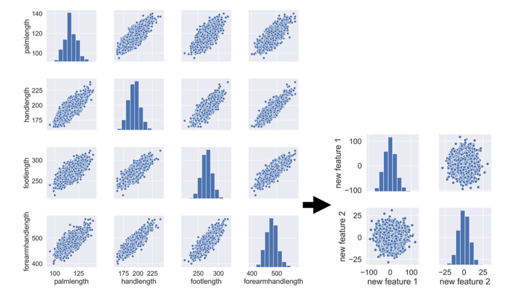

# Dimesionality Reduction in Python
Content:
- Chapter 1. Exploring High Dimensional Data
- Chapter 2. Feature Selection I - Selecting for the Feature Information
- Chapter 3. Feature Selection II - Selecting for Model Accuracy
- Chapter 4. Feature Extraction

### Chapter 1. Exploring High Dimensional Data
---
Checking standard deviation, Less variation will be taken out

Checking Tips
```python
data.describe()                 # For numerical data
data.describe(exclude='number') # For categorical data
```
Feature selection vs feature extraction

Type| Examples | Description
---|---|---
Feature Selection|A B C -> A B | Feature C was taken
Feature Extraction|A B C -> X Y | The features was blinded into 2 features

Illustration:



### Chapter 2. Feature Selection I - Selecting for the Feature Information
---
Creating feature
```python
print(ansur_df.shape)
```
```
(6068, 94)
```
```python
from sklearn.feature_selection import VarianceThreshold
sel = VarianceThreshold(threshold=1)
sel.fit(ansur_df)

mask = sel.get_support()
print(mask)
``` 
```
array([ True, True, ..., False, True])
```
```python
reduced_df = ansur_df.loc[:,mask]
print(reduct_df.shape)
```
```
(6068, 93)
```

Normalizing the variance,
see this if we normalize first the variance
the features selection reduced more than previous one
```python
from sklearn.feature_selection import VarianceThreshold
sel = VarianceThreshold(threshold=0.005)
sel.fit(ansur_df/ansur_df.mean())
mask = sel.get_support()
reduced_df = ansur_df.loc[:,mask]
print(reduced_df.shape)
```
```
(6068, 45)
```

Pairwise Correlation Creating Mask on Heatmap
```python
corr = ansur_df.corr()

# Generate a mask for the upper triangle
mask = np.triu(np.ones_like(corr, dtype=bool))

print(mask)
```

Reducing correlation value > 0.95
Dimension with correlated need to be drop since it is redundant information and to avoid overfitting

Code Example:
```python
# Calculate the correlation matrix and take the absolute value
corr_df = ansur_df.corr().abs()

# Create a True/False mask and apply it
mask = np.triu(np.ones_like(corr_df, dtype=bool))
tri_df = corr_df.mask(mask)

# List column names of highly correlated features (r > 0.95)
to_drop = [c for c in tri_df.columns if any(tri_df[c] >  0.95)]

# Drop the features in the to_drop list
reduced_df = ansur_df.drop(to_drop, axis=1)

print(f"The reduced_df DataFrame has {reduced_df.shape[1]} columns.")
```

### Chapter 3. Feature Selection II - Selecting for Model Accuracy
---

Building a diabetes classifier
You'll be using the Pima Indians diabetes dataset to predict whether a person has diabetes using logistic regression. There are 8 features and one target in this dataset. The data has been split into a training and test set and pre-loaded for you as X_train, y_train, X_test, and y_test.

A StandardScaler() instance has been predefined as scaler and a LogisticRegression() one as lr.

```python
# Fit the scaler on the training features and transform these in one go
X_train_std = scaler.fit_transform(X_train)

# Fit the logistic regression model on the scaled training data
lr.fit(X_train_std, y_train)

# Scale the test features
X_test_std = scaler.transform(X_test)

# Predict diabetes presence on the scaled test set
y_pred = lr.predict(X_test_std)

# Prints accuracy metrics and feature coefficients
print(f"{accuracy_score(y_test, y_pred):.1%} accuracy on test set.")
print(dict(zip(X.columns, abs(lr.coef_[0]).round(2))))
```
```
79.6% accuracy on test set.
    {'pregnant': 0.05,
     'glucose': 1.23,
     'diastolic': 0.03,
     'triceps': 0.24,
     'insulin': 0.19,
     'bmi': 0.38,
     'family': 0.35,
     'age': 0.34}
```
The hishest is 'glucose', if we drop the feature with coefficient under 1 then the score will relatively the same.

Automatic Recursive Feature Elimination (RFE)
Looping from all features to x features to find the optimum features recursive
```python
from sklearn.feature_selection import RFE
rfe = RFE(estimator=RandomForestClassifier(), n_features_to_select=6, verbose=1) # Step default 1
rfe.fit(X_train,y_train)
```

Regulized Regression aka Lasso Regression

Adding Alpha

Example:
```python
from sklearn.linear_model import Lasso
la = Lasso(alpha=0.05)
la.fit(X_train, y_train)
# Actual coefficients = [5 2 0]
print(la.coef_)
```
```
[4.07 0.59 0. ]
```
```python
print(la.score(X_test, y_test))
```
```
0.974
```

Adding alpha affect the accuracy, therefore there is LassoCV to find appropiate alpha to choose

Code Example:
```python
from sklearn.linear_model import LassoCV

# Create and fit the LassoCV model on the training set
lcv = LassoCV()
lcv.fit(X_train, y_train)
print(f'Optimal alpha = {lcv.alpha_:.3f}')

# Calculate R squared on the test set
r_squared = lcv.score(X_test, y_test)
print(f'The model explains {r_squared:.1%} of the test set variance')

# Create a mask for coefficients not equal to zero
lcv_mask = lcv.coef_ != 0
print(f'{sum(lcv_mask)} features out of {len(lcv_mask)} selected')
```
```
<script.py> output:
    Optimal alpha = 0.097
    The model explains 87.4% of the test set variance
    22 features out of 32 selected
```

Combining Feature Selector
```python
from sklearn.feature_selection import RFE
from sklearn.ensemble import GradientBoostingRegressor

# Select 10 features with RFE on a GradientBoostingRegressor, drop 3 features on each step
rfe_gb = RFE(estimator=GradientBoostingRegressor(), 
             n_features_to_select=10, step=3, verbose=1)
rfe_gb.fit(X_train, y_train)

# Calculate the R squared on the test set
r_squared = rfe_gb.score(X_test, y_test)
print(f'The model can explain {r_squared:.1%} of the variance in the test set')

# Assign the support array to gb_mask
gb_mask = rfe_gb.support_
```
```
Fitting estimator with 32 features.
Fitting estimator with 29 features.
Fitting estimator with 26 features.
Fitting estimator with 23 features.
Fitting estimator with 20 features.
Fitting estimator with 17 features.
Fitting estimator with 14 features.
Fitting estimator with 11 features.
The model can explain 85.2% of the variance in the test set
```

Repeating for GradientBoost, Regression Linear, and Lasso CV,
than creating mask to combine those models like code below
```python
# Sum the votes of the three models
votes = np.sum([lcv_mask, rf_mask, gb_mask], axis=0)

# Create a mask for features selected by all 3 models
meta_mask = votes >= 2
print(meta_mask)
```
```
<script.py> output:
    [False False  True  True False False False  True False False False  True
     False False False False False False False False False False  True False
     False  True False False False False False  True]
```


### Feature Extraction
---
