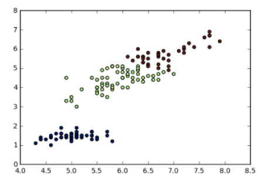

## Unsupervised Learning in Python
Cluster, transform, visualize, and extract insights from unlabeled datasets using scikit-learn and scipy

---

Chapter Overview:
- Chapter 1: Clustering for dataset exploration
- Chapter 2: Visualizatin with hierarchical clustering and t-SNE
- Chapter 3: Decorrelating your data and dimesion reduction
- Chapter 4: Discovering interpretable features

### Chapter 1. Clustering for dataset exploration
---
Practicing Clustering using sklearn
```python
# Sample Data 
sample = [[ 5. 3.3 1.4 0.2]
[ 5. 3.5 1.3 0.3]
...
[ 7.2 3.2 6. 1.8]]

# Executing Scikit Learn
from sklearn.cluster import KMeans
model = KMeans(n_clusters=3)
model.fit(samples)
lables = model.predict(samples)

# Visualizing
import matplotlib.pyplot as plt
xs = samples[:,0]
ys = samples[:,2]
plt.scatter(xs, ys, c=labels)
plt.show()
```


Evaluating Cluster
```python
import pandas as pd
df = pd.DataFrame({'labels': labels, 'species': species})
ct = pd.crosstab(df['labels'], df['species'])
print(ct)
```
```python
# Measuring Inertia
from sklearn.cluster import KMeans

model = KMeans(n_clusters=3)

model.fit(samples)
print(model.inertia_)
```
you can loop to get other intertia to observe best clustering based on 'elbow law'


Standar Scaler
 
```python
# to create standarization, mean 0 and variance 1
from sklearn.preprocessing import StandardScaler
scaler = StandardScaler()
scaler.fit(samples)
StandardScaler(copy=True, with_mean=True, with_std=True)

samples_scaled = scaler.transform(samples)

# Or using Pipeline
from sklearn.preprocessing import StandardScaler
from sklearn.cluster import KMeans
scaler = StandardScaler()
kmeans = KMeans(n_clusters=3)

from sklearn.pipeline import make_pipeline

pipeline = make_pipeline(scaler, kmeans)
pipeline.fit(samples)
```
> Note:
>
> fit()/predict() in model, fit()/transform() in scaler
>
> Here is [youtube](https://www.youtube.com/watch?v=2tuBREK_mgE) reference to understand standarization mean

### Chapter 2. Visualizatin with hierarchical clustering and t-SNE
---
How dendrograms looks like:


Code example hierarchical clustering with SciPy
```python
import matplotlib.pyplot as plt
from scipy.cluster.hierarchy import lingkage, dendrogram
mregings = linkage(samples, method='complete') # Linkage Method
dendrogram(mergings,
            labels=country_names,
            leaf_rotation=90,
            leaf_font_size=6
)
```
Add this code to exctract cluster labels
```python
labels = fcluster(mergings, 15, criterion='distance') # 15 is thhreshold of distance in linkage method
print(labels)
```

T-SNE for visualizing 2D maps

sample code in sklearn
```python
import matplotlib.pyplot as plt
from sklearn.manifold import TSNE
model = TSNE(learning_rate=100)
transformed = model.fit_transform(samples)
xs = transformed[:,0]
ys = transformed[:,1]
plt.scatter(xs, ys, c=species)
plt.show()
```

### Chapter 3: Decorrelating your data and dimesion reduction
---
Sample Code:
```python
import matplotlib.pyplot as plt
from sklearn.decomposition  import PCA
pca = PCA()
pca.fit(samples)
features  = range(pca.n_components_)

plt.bar(features, pca.explained_variance_)
plt.xticks(features)
plt.ylabel('variance')
plt.xlabel('PCA feature')
plt.show()
```


in order to keep n features you can use this code
```python
pca = PCA(n_components=2)
pca.fit(samples)
transformed = pca.transform(samples)
print(transformed.shape)
```

### Chapter 4: Discovering interpretable features
---
Non-Negative Matrix Factorization (NMF) is dimension reduction tech, which is more interpretable. All features have to be positive.
Dimension of components = dimension of samples.
Reducted by matrix factorization
Example application in 
- TF-IDF
- Image Encoded
- Audio Spectrogram
- Purchase History
- etc.

```python
from sklearn.decomposition import NMF
nmf = NMF(n_components=10)
nmf.fit(articles)
```
